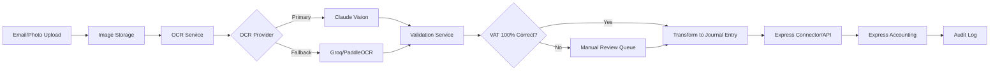

# AutoAcct Domain Knowledge

> This document captures the business context, technical architecture, and domain-specific knowledge for the AutoAcct project. It serves as the "source of truth" for anyone integrating Claude AI with AutoAcct.

---

## 📋 Table of Contents

1. [Business Overview](#business-overview)
2. [Data Model](#data-model)
3. [System Architecture](#system-architecture)
4. [Business Rules](#business-rules)
5. [Pain Points](#pain-points)
6. [Success Criteria](#success-criteria)

---

## 🎯 Business Overview

### Problem Statement

**Current Situation:**  
Accountants at accounting firms spend hours manually reading receipts one-by-one and keying them into Express Accounting software. With each client company generating 50-100 receipts per month, and firms serving multiple clients, this manual data entry becomes a significant time drain.

**Pain Points:**
- ⏱️ **Time-consuming:** Manual keying of 50-100 receipts/month per client
- 🔢 **Error-prone:** Human errors in data entry, especially VAT amounts
- 📈 **Scalability:** Cannot efficiently handle multiple clients simultaneously
- 💰 **Opportunity cost:** Accountants spending time on data entry instead of consulting

### Solution

AutoAcct uses **OCR + AI** to automatically:
1. **Extract** structured data from receipt/invoice images (amount, vendor, date, VAT)
2. **Validate** the extracted data against business rules
3. **Transform** receipts into double-entry journal entries
4. **Export** directly to Express Accounting system

**Value Proposition:**
- ✅ **10x faster** than manual entry
- ✅ **Higher accuracy** with AI-powered OCR (targeting 90%+ accuracy)
- ✅ **100% VAT compliance** for tax filing
- ✅ **Batch processing** for multiple receipts at once

### Target Users

**Primary:**
- ✅ **Accounting firms** providing bookkeeping services to multiple businesses
- ✅ **Accountants** managing 5-20+ client companies simultaneously

**Use Cases:**
- 📊 **Monthly bookkeeping** for SME clients
- 🧾 **Tax preparation** (VAT, corporate tax)
- 💼 **Consulting services** for individuals and corporations (accounting & tax)

**Not for (currently):**
- ❌ Individual SME owners (may expand later)
- ❌ Freelancers (may expand later)
- ❌ Large enterprises (different requirements)

---

## 🗂️ Data Model

### Receipt / Invoice

**Core Fields:**
```typescript
interface Receipt {
  id: string;                    // MongoDB ObjectId
  imageUrl: string;              // Original photo URL
  imageBase64?: string;          // Base64 for OCR processing
  
  // OCR Results
  amountSatang: number;          // Total amount in Satang (1 Baht = 100 Satang)
  currency: 'THB';               // Always Thai Baht
  vendorName?: string;           // Merchant name
  issueDate?: string;            // ISO 8601 format (YYYY-MM-DD)
  vatAmountSatang?: number;      // VAT amount in Satang (7% standard)
  
  // Metadata
  ocrProvider: 'claude' | 'groq' | 'paddle'; // Which OCR was used
  ocrConfidence?: number;        // 0.0 - 1.0
  ocrRawText?: string;           // Raw OCR output for debugging
  
  // Status
  status: 'pending' | 'validated' | 'exported' | 'error';
  validatedBy?: string;          // User ID if manually verified
  validatedAt?: Date;
  
  // Correlation
  correlationId: string;         // Track through entire pipeline
  journalEntryId?: string;       // Link to exported journal entry
}
```

**Business Rules:**
- ✅ All amounts MUST be in **Satang** (integer, no decimals)
- ✅ VAT is 7% in Thailand (but may vary for special cases)
- ✅ `correlationId` must flow through OCR → Validation → Export
- ❌ Do NOT store credit card numbers or sensitive PII

### Journal Entry

**Core Fields:**
```typescript
interface JournalEntry {
  id: string;
  correlationId: string;
  txDate: string;                // Transaction date (ISO)
  
  lines: JournalEntryLine[];     // Double-entry accounting lines
  
  externalRef?: string;          // Reference to receipt ID
  exportedAt?: Date;
  exportProvider: 'express' | 'teable';
}

interface JournalEntryLine {
  accountCode: string;           // e.g., "5000-MEALS", "1000-CASH"
  amountSatang: number;
  side: 'DEBIT' | 'CREDIT';
  memo?: string;
}
```

**Business Rules:**
- ✅ Debits MUST equal Credits (double-entry principle)
- ✅ Use Thai Chart of Accounts codes (customizable per client)
- ✅ All amounts in Satang

---

## 🏗️ System Architecture

### Current Stack

**Frontend:**
> **TODO:** ระบุ framework (React? Vue? Next.js?) หรือยังไม่มี UI?

**Backend:**
- **Runtime:** Bun (Node.js compatible)
- **Database:** MongoDB
- **API Style:** REST (planned)

**External Systems:**

**OCR Providers:**
- **Current:** None (manual entry)
- **Tested:** PaddleOCR (requires extensive tuning, not in production)
- **Planned:** Claude Vision (primary), Groq (fallback)

**Accounting System:**
- **Express Accounting** by Dhanakom
  - Type: On-premise desktop software
  - Deployment: LAN multi-user license
  - Language: Thai interface
  - Usage: Industry standard for Thai accounting firms
  - Website: [dhanakom.com](https://www.dhanakom.com/14550472/%E0%B9%82%E0%B8%9B%E0%B8%A3%E0%B9%81%E0%B8%81%E0%B8%A3%E0%B8%A1%E0%B8%9A%E0%B8%B1%E0%B8%8D%E0%B8%8A%E0%B8%B5-express)
  - API: Research needed (may require bridge/connector)

**Optional:**
- **Teable:** For spreadsheet-like UI on MongoDB data (optional)

### Receipt Input Channels

**Current Channels:**

1. **Email (Primary)**
   - Clients scan receipts → PDF → Email to accounting firm
   - Format: PDF (multi-page or single)
   - Frequency: Weekly or monthly batches

2. **Manual Photo Capture**
   - Admin receives paper receipts → Takes photos
   - Format: JPEG/PNG
   - Quality: Variable (lighting, angle)

**Future Channels (Under Consideration):**
- LINE (maybe) - for direct client submission
- Web Upload - for self-service portal
- Mobile App - for on-the-go capture

### Data Flow



**Key Stages:**
1. **Upload:** Receipt photo/PDF → Email or Admin capture
2. **Storage:** Image storage (local or cloud)
3. **OCR:** Extract structured data (amount, vendor, date, VAT)
4. **Validation:** Auto-validate or human-in-the-loop for critical fields (especially VAT)
5. **Mapping:** Receipt → Journal Entry with appropriate account codes
6. **Export:** Push to Express Accounting (via API or data import)
7. **Audit:** Log every transaction for compliance

**Critical Requirements:**
- ⚠️ **VAT must be 100% accurate** (tax compliance)
- ⚠️ **Batch processing** support (process 50-100 receipts at once)
- ⚠️ **Speed:** Faster than manual entry (target: 10x improvement)
- ⚠️ **Manual review queue** for low-confidence OCR results

---

## ⚖️ Business Rules

### Amount Handling

**Why Satang?**
- Avoid floating-point errors (0.1 + 0.2 ≠ 0.3)
- Match Thai banking standards
- Integer arithmetic is faster and more reliable

**Conversion:**
```typescript
// User sees: 350.50 Baht
// System stores: 35050 Satang

const bahtToSatang = (baht: number) => Math.round(baht * 100);
const satangToBaht = (satang: number) => satang / 100;
```

### VAT Calculation

**Standard VAT:** 7% (Thailand)

**CRITICAL:** VAT accuracy must be 100% for tax filing compliance.

```typescript
// Extract VAT from total (VAT-inclusive amount)
const extractVAT = (totalSatang: number) => {
  const baseAmount = Math.round(totalSatang / 1.07);
  const vat = totalSatang - baseAmount;
  return { baseAmount, vat };
};

// Example:
// Total: 107 Baht (10700 Satang)
// Base: 100 Baht (10000 Satang)
// VAT:  7 Baht (700 Satang)
```

**Edge Cases:**
- Some items are VAT-exempt (medical, education)
- Some transactions have 0% VAT
- **Always verify VAT field from receipt** rather than calculating

### Correlation ID

**Format:** `autoacct-{timestamp}-{random}`

**Purpose:**
- Track a single receipt through entire pipeline
- Enable debugging ("Where did this transaction fail?")
- Required for audit trails
- Link receipt → OCR result → journal entry → Express export

---

## 🚨 Pain Points

### 1. Manual Entry Time Drain

**Current Situation:**
- ⏱️ Each client has 50-100 receipts/month
- 👥 Accounting firm serves multiple clients (5-20+)
- ⌨️ Manual keying takes 2-5 minutes per receipt
- 📊 **Total:** 500-2000 receipts/month = 16-160 hours of data entry

**Impact:**
- Accountants cannot focus on high-value consulting work
- Bottleneck in monthly closing process
- Overtime during tax season

### 2. OCR Accuracy Requirements

**Challenge:**
- ❌ **Current:** No OCR (100% manual)
- ❌ **Tried:** PaddleOCR requires extensive tuning (not production-ready)
- ⚠️ **Requirement:** If OCR accuracy < 90%, still need to verify each receipt manually → No time saved

**Critical Fields:**
- 🔴 **VAT amount:** MUST be 100% accurate (tax compliance)
- 🟡 **Total amount:** Very important (affects financial statements)
- 🟡 **Date:** Important (affects period closing)
- 🟢 **Vendor name:** Less critical (can be corrected later)

**Edge Cases:**
- Handwritten receipts (common in Thailand)
- Faded thermal paper receipts
- Mixed Thai/English text
- Non-standard receipt formats (small vendors)
- Poor photo quality (dark, blurry, angled)

### 3. Batch Processing Requirement

**Need:**
- Process 50-100 receipts at once (monthly batch)
- Can't process one-by-one (too slow)
- Need queue system with progress tracking
- Need retry mechanism for failed OCR

**Current Blocker:**
- No batch processing infrastructure
- No automated pipeline

### 4. Express Integration

**Challenge:**
- Express Accounting is on-premise desktop software (not SaaS)
- No official public API documented
- May require:
  - Custom connector/bridge
  - Direct database access (risky)
  - Import via CSV/Excel (manual step)
  - Screen automation (fragile)

**Unknowns:**
- ❓ Does Express have an API we can use?
- ❓ What's the best integration approach?
- ❓ Can we automate journal entry creation?

---

## ✅ Success Criteria

### Accuracy Targets

| Field | Target Accuracy | Priority | Notes |
|-------|----------------|----------|-------|
| **VAT Amount** | **100%** | 🔴 Critical | Tax compliance, cannot fail |
| **Total Amount** | > 95% | 🔴 Critical | Financial accuracy |
| **Date** | > 90% | 🟡 High | Period closing |
| **Vendor Name** | > 80% | 🟢 Medium | Can be corrected later |
| **Line Items** | > 70% | 🟢 Low | Nice to have |

**Validation Strategy:**
- Auto-approve if confidence > 95% for all critical fields
- Manual review queue if confidence < 95% for VAT or amount
- Accountant approval required before export to Express

### Performance Targets

| Metric | Target | Current (Manual) | Improvement |
|--------|--------|------------------|-------------|
| **OCR Latency** | < 3 sec/receipt | N/A | - |
| **End-to-End** | < 10 sec/receipt | 2-5 min | **10-30x faster** |
| **Batch (100 receipts)** | < 5 minutes | 3-8 hours | **36-96x faster** |

### Cost Targets

**Current Cost (Manual):**
- Accountant time: 100 receipts × 3 min = 300 min = 5 hours
- Labor cost: 5 hours × ฿300/hour = ฿1,500 per 100 receipts
- **Cost per receipt:** ฿15

**Target Cost (Automated):**
- Claude OCR: ฿0.50 per receipt (estimated)
- Infrastructure: ฿500/month ÷ 1000 receipts = ฿0.50 per receipt
- Manual review (10%): 10 receipts × 1 min × ฿5/min = ฿50
- **Total cost per 100 receipts:** ฿50 (OCR) + ฿50 (infra) + ฿50 (review) = ฿150
- **Cost per receipt:** ฿1.50

**ROI:** ฿15 → ฿1.50 = **90% cost reduction** (10x cheaper)

### Reliability Targets

- **OCR Success Rate:** > 95% (with fallback to Groq/PaddleOCR)
- **Export Success Rate:** > 99% (to Express)
- **System Uptime:** > 99.5% during business hours (8 AM - 6 PM)
- **Data Integrity:** 100% (no lost receipts, full audit trail)

---

## 📝 Notes for Contributors

**How to update this document:**

1. **Answer TODO sections** as you learn more about AutoAcct
2. **Add real examples** from actual receipts/invoices
3. **Document edge cases** you encounter during testing
4. **Keep it current** - update when business rules change

**This is a living document!** Every recipe in this cookbook should reference the relevant section here.

**Questions to resolve:**
- [ ] Does Express Accounting have an API? How to integrate?
- [ ] What's the frontend stack? Or is it backend-only with manual export?
- [ ] What image storage solution? (S3, local, MongoDB GridFS?)
- [ ] Authentication model? (Who can upload, review, approve?)
- [ ] Multi-tenancy? (One database for all clients, or separate per firm?)

---

*Last updated: 2026-01-22 (Updated with real business context from interview)*