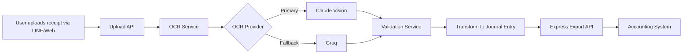

# AutoAcct Domain Knowledge

> This document captures the business context, technical architecture, and domain-specific knowledge for the AutoAcct project. It serves as the "source of truth" for anyone integrating Claude AI with AutoAcct.

---

## 📋 Table of Contents

1. [Business Overview](#business-overview)
2. [Data Model](#data-model)
3. [System Architecture](#system-architecture)
4. [Business Rules](#business-rules)
5. [Pain Points](#pain-points)
6. [Success Criteria](#success-criteria)

---

## 🎯 Business Overview

### Problem Statement
> **TODO:** ใส่รายละเอียดว่า AutoAcct แก้ปัญหาอะไร ให้ใคร

*Example: "SMEs และ Freelancers ในไทยต้องทำบัญชีด้วยตัวเอง แต่มักเสียเวลากับการป้อนข้อมูลจากใบเสร็จ/ใบกำกับภาษี ซึ่งใช้เวลานาน และผิดพลาดบ่อย"*

### Solution
> **TODO:** AutoAcct แก้ปัญหายังไง

*Example: "AutoAcct ใช้ OCR + AI เพื่อแปลงรูปภาพใบเสร็จเป็นรายการบัญชีอัตโนมัติ แล้วส่งออกไปยังระบบบัญชี Express Accounting โดยตรง"*

### Target Users
> **TODO:** ใครใช้ระบบนี้

- [ ] SME owners
- [ ] Freelancers
- [ ] Accountants
- [ ] Bookkeepers
- [ ] Others: _______

---

## 🗂️ Data Model

### Receipt / Invoice

**Core Fields:**
```typescript
interface Receipt {
  id: string;                    // MongoDB ObjectId
  imageUrl: string;              // Original photo URL
  imageBase64?: string;          // Base64 for OCR processing
  
  // OCR Results
  amountSatang: number;          // Total amount in Satang (1 Baht = 100 Satang)
  currency: 'THB';               // Always Thai Baht
  vendorName?: string;           // Merchant name
  issueDate?: string;            // ISO 8601 format (YYYY-MM-DD)
  vatAmountSatang?: number;      // VAT amount in Satang (7% standard)
  
  // Metadata
  ocrProvider: 'claude' | 'groq' | 'paddle'; // Which OCR was used
  ocrConfidence?: number;        // 0.0 - 1.0
  ocrRawText?: string;           // Raw OCR output for debugging
  
  // Status
  status: 'pending' | 'validated' | 'exported' | 'error';
  validatedBy?: string;          // User ID if manually verified
  validatedAt?: Date;
  
  // Correlation
  correlationId: string;         // Track through entire pipeline
  journalEntryId?: string;       // Link to exported journal entry
}
```

**Business Rules:**
- ✅ All amounts MUST be in **Satang** (integer, no decimals)
- ✅ VAT is 7% in Thailand (but may vary for special cases)
- ✅ `correlationId` must flow through OCR → Validation → Export
- ❌ Do NOT store credit card numbers or sensitive PII

### Journal Entry

**Core Fields:**
```typescript
interface JournalEntry {
  id: string;
  correlationId: string;
  txDate: string;                // Transaction date (ISO)
  
  lines: JournalEntryLine[];     // Double-entry accounting lines
  
  externalRef?: string;          // Reference to receipt ID
  exportedAt?: Date;
  exportProvider: 'express' | 'teable';
}

interface JournalEntryLine {
  accountCode: string;           // e.g., "5000-MEALS", "1000-CASH"
  amountSatang: number;
  side: 'DEBIT' | 'CREDIT';
  memo?: string;
}
```

**Business Rules:**
- ✅ Debits MUST equal Credits (double-entry principle)
- ✅ Use Thai Chart of Accounts codes (customizable per client)
- ✅ All amounts in Satang

---

## 🏗️ System Architecture

### Current Stack

**Frontend:**
> **TODO:** ระบุ framework (React? Vue? Next.js?)

**Backend:**
- **Runtime:** Bun (Node.js compatible)
- **Database:** MongoDB
- **API Style:** REST / GraphQL (ระบุ)

**External APIs:**
- **OCR:** Groq (current), Claude (planned), PaddleOCR (fallback)
- **Accounting Export:** Express Accounting API
- **Database:** Teable (optional, for spreadsheet-like UI)

### Data Flow



**Key Stages:**
1. **Upload:** Receipt photo (JPEG/PNG) → S3/Local Storage
2. **OCR:** Extract structured data (amount, vendor, date, VAT)
3. **Validation:** Human-in-the-loop or auto-validation rules
4. **Mapping:** Receipt → Journal Entry (with account codes)
5. **Export:** Push to Express Accounting via API
6. **Audit:** Log every export for compliance

---

## ⚖️ Business Rules

### Amount Handling

**Why Satang?**
- Avoid floating-point errors (0.1 + 0.2 ≠ 0.3)
- Match Thai banking standards
- Integer arithmetic is faster and more reliable

**Conversion:**
```typescript
// User sees: 350.50 Baht
// System stores: 35050 Satang

const bahtToSatang = (baht: number) => Math.round(baht * 100);
const satangToBaht = (satang: number) => satang / 100;
```

### VAT Calculation

**Standard VAT:** 7%
```typescript
// From total (includes VAT)
const extractVAT = (totalSatang: number) => {
  const baseAmount = Math.round(totalSatang / 1.07);
  const vat = totalSatang - baseAmount;
  return { baseAmount, vat };
};
```

### Correlation ID

**Format:** `autoacct-{timestamp}-{random}`

**Purpose:**
- Track a single receipt through entire pipeline
- Enable debugging ("Where did this transaction fail?")
- Required for audit trails

---

## 🚨 Pain Points

### 1. OCR Accuracy
> **TODO:** อธิบายปัญหาปัจจุบัน

*Example issues:*
- [ ] Handwritten receipts
- [ ] Poor image quality (dark photos)
- [ ] Mixed Thai/English text
- [ ] Non-standard formats

### 2. Manual Verification
> **TODO:** ต้อง verify ด้วยตัวเองบ่อยแค่ไหน

### 3. Export Reliability
> **TODO:** Express API มีปัญหาอะไรบ้าง

*Example issues:*
- [ ] API downtime
- [ ] Rate limiting
- [ ] Timeout errors
- [ ] Validation errors from Express side

---

## ✅ Success Criteria

### Accuracy Targets
- **OCR Accuracy:** > 90% for printed receipts
- **VAT Detection:** > 95% (critical for tax compliance)
- **Vendor Name:** > 80% (less critical)

### Performance Targets
- **OCR Latency:** < 3 seconds per receipt
- **End-to-End:** < 10 seconds (upload → export)
- **Batch Processing:** 100 receipts in < 5 minutes

### Cost Targets
- **OCR Cost:** < 0.50 Baht per receipt
- **Total Cost per Transaction:** < 1 Baht

### Reliability Targets
- **Export Success Rate:** > 99%
- **Retry Success Rate:** > 95% (after initial failure)

---

## 📝 Notes for Contributors

**How to update this document:**

1. **Answer TODO sections** as you learn more about AutoAcct
2. **Add real examples** from actual receipts/invoices
3. **Document edge cases** you encounter
4. **Keep it current** - update when business rules change

**This is a living document!** Every recipe in this cookbook should reference the relevant section here.

---

*Last updated: 2026-01-22*